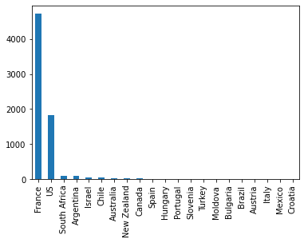
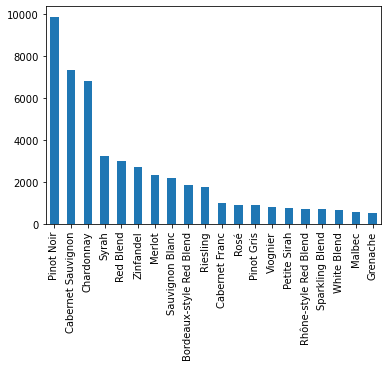
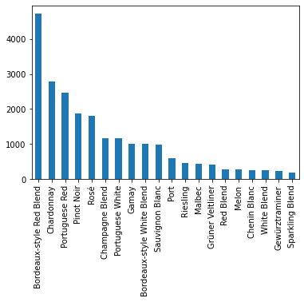

#### 李坤 3220201059
## 1.对数据集进行处理，转换成适合关联规则挖掘的形式


```python
import scipy.stats as stats
import pandas as pd
import matplotlib.pyplot as plt

df = pd.read_csv('data/winemag-data-130k-v2.csv', index_col=0)
df.head()
```


<div>
<style scoped>
    .dataframe tbody tr th:only-of-type {
        vertical-align: middle;
    }

    .dataframe tbody tr th {
        vertical-align: top;
    }

    .dataframe thead th {
        text-align: right;
    }
</style>
<table border="1" class="dataframe">
  <thead>
    <tr style="text-align: right;">
      <th></th>
      <th>country</th>
      <th>description</th>
      <th>designation</th>
      <th>points</th>
      <th>price</th>
      <th>province</th>
      <th>region_1</th>
      <th>region_2</th>
      <th>taster_name</th>
      <th>taster_twitter_handle</th>
      <th>title</th>
      <th>variety</th>
      <th>winery</th>
    </tr>
  </thead>
  <tbody>
    <tr>
      <th>0</th>
      <td>Italy</td>
      <td>Aromas include tropical fruit, broom, brimston...</td>
      <td>Vulkà Bianco</td>
      <td>87</td>
      <td>NaN</td>
      <td>Sicily &amp; Sardinia</td>
      <td>Etna</td>
      <td>NaN</td>
      <td>Kerin O’Keefe</td>
      <td>@kerinokeefe</td>
      <td>Nicosia 2013 Vulkà Bianco  (Etna)</td>
      <td>White Blend</td>
      <td>Nicosia</td>
    </tr>
    <tr>
      <th>1</th>
      <td>Portugal</td>
      <td>This is ripe and fruity, a wine that is smooth...</td>
      <td>Avidagos</td>
      <td>87</td>
      <td>15.0</td>
      <td>Douro</td>
      <td>NaN</td>
      <td>NaN</td>
      <td>Roger Voss</td>
      <td>@vossroger</td>
      <td>Quinta dos Avidagos 2011 Avidagos Red (Douro)</td>
      <td>Portuguese Red</td>
      <td>Quinta dos Avidagos</td>
    </tr>
    <tr>
      <th>2</th>
      <td>US</td>
      <td>Tart and snappy, the flavors of lime flesh and...</td>
      <td>NaN</td>
      <td>87</td>
      <td>14.0</td>
      <td>Oregon</td>
      <td>Willamette Valley</td>
      <td>Willamette Valley</td>
      <td>Paul Gregutt</td>
      <td>@paulgwine</td>
      <td>Rainstorm 2013 Pinot Gris (Willamette Valley)</td>
      <td>Pinot Gris</td>
      <td>Rainstorm</td>
    </tr>
    <tr>
      <th>3</th>
      <td>US</td>
      <td>Pineapple rind, lemon pith and orange blossom ...</td>
      <td>Reserve Late Harvest</td>
      <td>87</td>
      <td>13.0</td>
      <td>Michigan</td>
      <td>Lake Michigan Shore</td>
      <td>NaN</td>
      <td>Alexander Peartree</td>
      <td>NaN</td>
      <td>St. Julian 2013 Reserve Late Harvest Riesling ...</td>
      <td>Riesling</td>
      <td>St. Julian</td>
    </tr>
    <tr>
      <th>4</th>
      <td>US</td>
      <td>Much like the regular bottling from 2012, this...</td>
      <td>Vintner's Reserve Wild Child Block</td>
      <td>87</td>
      <td>65.0</td>
      <td>Oregon</td>
      <td>Willamette Valley</td>
      <td>Willamette Valley</td>
      <td>Paul Gregutt</td>
      <td>@paulgwine</td>
      <td>Sweet Cheeks 2012 Vintner's Reserve Wild Child...</td>
      <td>Pinot Noir</td>
      <td>Sweet Cheeks</td>
    </tr>
  </tbody>
</table>
</div>


初步分析数据集，推测可能存在的频繁模式和关联规则：

1.葡萄酒产自的国家、酿酒的葡萄品种与酒庄之间——某些特定产地的葡萄酒可能有自己固定的用来酿酒的葡萄品种；

2.品酒师、葡萄酒品种与打分之间——品酒师们可能钟爱某几种特定的葡萄酒品种，并且打分时有某种规律。


```python
# 筛选出国家、葡萄品种、酒庄信息，构成事务集
transactions_1 = []
for index, row in df.iterrows():
    transactions_1 += [(row['country'], row['variety'], row['winery'])]
transactions_1[:20]
```


    [('Italy', 'White Blend', 'Nicosia'),
     ('Portugal', 'Portuguese Red', 'Quinta dos Avidagos'),
     ('US', 'Pinot Gris', 'Rainstorm'),
     ('US', 'Riesling', 'St. Julian'),
     ('US', 'Pinot Noir', 'Sweet Cheeks'),
     ('Spain', 'Tempranillo-Merlot', 'Tandem'),
     ('Italy', 'Frappato', 'Terre di Giurfo'),
     ('France', 'Gewürztraminer', 'Trimbach'),
     ('Germany', 'Gewürztraminer', 'Heinz Eifel'),
     ('France', 'Pinot Gris', 'Jean-Baptiste Adam'),
     ('US', 'Cabernet Sauvignon', 'Kirkland Signature'),
     ('France', 'Gewürztraminer', 'Leon Beyer'),
     ('US', 'Cabernet Sauvignon', 'Louis M. Martini'),
     ('Italy', 'Nerello Mascalese', 'Masseria Setteporte'),
     ('US', 'Chardonnay', 'Mirassou'),
     ('Germany', 'Riesling', 'Richard Böcking'),
     ('Argentina', 'Malbec', 'Felix Lavaque'),
     ('Argentina', 'Malbec', 'Gaucho Andino'),
     ('Spain', 'Tempranillo Blend', 'Pradorey'),
     ('US', 'Meritage', 'Quiévremont')]


```python
# 筛选出品酒师姓名、评分、葡萄品种、酒庄信息，构成事务集
transactions_2 = []
for index, row in df.iterrows():
    transactions_2 += [(row['taster_name'], row['points'], row['variety'], row['winery'])]
transactions_2[:20]
```


    [('Kerin O’Keefe', 87, 'White Blend', 'Nicosia'),
     ('Roger Voss', 87, 'Portuguese Red', 'Quinta dos Avidagos'),
     ('Paul Gregutt', 87, 'Pinot Gris', 'Rainstorm'),
     ('Alexander Peartree', 87, 'Riesling', 'St. Julian'),
     ('Paul Gregutt', 87, 'Pinot Noir', 'Sweet Cheeks'),
     ('Michael Schachner', 87, 'Tempranillo-Merlot', 'Tandem'),
     ('Kerin O’Keefe', 87, 'Frappato', 'Terre di Giurfo'),
     ('Roger Voss', 87, 'Gewürztraminer', 'Trimbach'),
     ('Anna Lee C. Iijima', 87, 'Gewürztraminer', 'Heinz Eifel'),
     ('Roger Voss', 87, 'Pinot Gris', 'Jean-Baptiste Adam'),
     ('Virginie Boone', 87, 'Cabernet Sauvignon', 'Kirkland Signature'),
     ('Roger Voss', 87, 'Gewürztraminer', 'Leon Beyer'),
     ('Virginie Boone', 87, 'Cabernet Sauvignon', 'Louis M. Martini'),
     ('Kerin O’Keefe', 87, 'Nerello Mascalese', 'Masseria Setteporte'),
     ('Matt Kettmann', 87, 'Chardonnay', 'Mirassou'),
     ('Anna Lee C. Iijima', 87, 'Riesling', 'Richard Böcking'),
     ('Michael Schachner', 87, 'Malbec', 'Felix Lavaque'),
     ('Michael Schachner', 87, 'Malbec', 'Gaucho Andino'),
     ('Michael Schachner', 87, 'Tempranillo Blend', 'Pradorey'),
     ('Alexander Peartree', 87, 'Meritage', 'Quiévremont')]


## 2.找出频繁模式

### 2.1使用Apriori算法


```python
from collections import defaultdict
import itertools


def apriori(transactions, support=0.1, confidence=0.8, lift=1, minlen=2, maxlen=2):
    item_2_tranidxs = defaultdict(list)
    itemset_2_tranidxs = defaultdict(list)

    for tranidx, tran in enumerate(transactions):
        for item in tran:
            item_2_tranidxs[item].append(tranidx)
            itemset_2_tranidxs[frozenset([item])].append(tranidx)

    item_2_tranidxs = dict([(k, frozenset(v)) for k, v in item_2_tranidxs.items()])
    itemset_2_tranidxs = dict([
        (k, frozenset(v)) for k, v in itemset_2_tranidxs.items()])

    tran_count = float(len(transactions))

    valid_items = set(item
        for item, tranidxs in item_2_tranidxs.items()
            if (len(tranidxs) / tran_count >= support))

    pivot_itemsets = [frozenset([item]) for item in valid_items]
    freqsets = []

    if minlen == 1:
        freqsets.extend(pivot_itemsets)

    for i in range(maxlen - 1):
        new_itemset_size = i + 2
        new_itemsets = []

        for pivot_itemset in pivot_itemsets:
            pivot_tranidxs = itemset_2_tranidxs[pivot_itemset]
            for item, tranidxs in item_2_tranidxs.items():
                if item not in pivot_itemset:
                    common_tranidxs = pivot_tranidxs & tranidxs
                    if len(common_tranidxs) / tran_count >= support:
                        new_itemset = frozenset(pivot_itemset | set([item]))
                        if new_itemset not in itemset_2_tranidxs:
                            new_itemsets.append(new_itemset)
                            itemset_2_tranidxs[new_itemset] = common_tranidxs

        if new_itemset_size > minlen - 1:
            freqsets.extend(new_itemsets)

        pivot_itemsets = new_itemsets

    for freqset in freqsets:
        for item in freqset:
            rhs = frozenset([item])
            lhs = freqset - rhs
            support_rhs = len(itemset_2_tranidxs[rhs]) / tran_count
            if len(lhs) == 0:
                lift_rhs = float(1)
                if support_rhs >= support and support_rhs > confidence and lift_rhs > lift:
                    yield (lhs, rhs, support_rhs, support_rhs, lift_rhs)
            else:
                confidence_lhs_rhs = len(itemset_2_tranidxs[freqset]) \
                    / float(len(itemset_2_tranidxs[lhs]))
                lift_lhs_rhs = confidence_lhs_rhs / support_rhs

                if confidence_lhs_rhs >= confidence and lift_lhs_rhs > lift:
                    support_lhs_rhs = len(itemset_2_tranidxs[freqset]) / tran_count
                    yield (lhs, rhs, support_lhs_rhs, confidence_lhs_rhs, lift_lhs_rhs)
```

设置频繁项集支持度、置信度、lift阈值：（support>0.03, confidence>0.1, lift>1）


```python
#第一类：country-variety-winery中的频繁模式
rules_1 = apriori(transactions_1, support=0.03, confidence=0.1, lift=1)
rules1_sorted = sorted(rules_1, key=lambda x: (x[4], x[3], x[2]), reverse=True)

for r in rules1_sorted:
    print(r)
```

    (frozenset({'Bordeaux-style Red Blend'}), frozenset({'France'}), 0.03635426364342815, 0.6832971800433839, 4.019771773295553)
    (frozenset({'France'}), frozenset({'Bordeaux-style Red Blend'}), 0.03635426364342815, 0.2138686461775223, 4.019771773295553)
    (frozenset({'Cabernet Sauvignon'}), frozenset({'US'}), 0.05628178593686284, 0.7722761824324325, 1.841580575864628)
    (frozenset({'US'}), frozenset({'Cabernet Sauvignon'}), 0.05628178593686284, 0.13421033318655512, 1.841580575864628)
    (frozenset({'Pinot Noir'}), frozenset({'US'}), 0.07605542774926714, 0.7448010849909584, 1.7760630745882846)
    (frozenset({'US'}), frozenset({'Pinot Noir'}), 0.07605542774926714, 0.18136283575517392, 1.7760630745882844)
    (frozenset({'Chardonnay'}), frozenset({'US'}), 0.052327057574381976, 0.5786607674636263, 1.3798825518863749)
    (frozenset({'US'}), frozenset({'Chardonnay'}), 0.052327057574381976, 0.12477983267283135, 1.3798825518863749)


```python
#第二类：taster-points-variety-winery中的频繁模式
rules_2 = apriori(transactions_2, support=0.03, confidence=0.1, lift=1)
rules2_sorted = sorted(rules_2, key=lambda x: (x[4], x[3], x[2]), reverse=True)

for r in rules2_sorted:
    print(r)
```

    (frozenset({'Bordeaux-style Red Blend'}), frozenset({'Roger Voss'}), 0.03623885328265536, 0.6811279826464208, 3.4697375963211554)
    (frozenset({'Roger Voss'}), frozenset({'Bordeaux-style Red Blend'}), 0.03623885328265536, 0.18460453084581013, 3.469737596321155)
    (frozenset({87}), frozenset({nan}), 0.03125312569727093, 0.23988661194117994, 1.1880164167279035)
    (frozenset({nan}), frozenset({87}), 0.03125312569727093, 0.1547782350251486, 1.1880164167279035)


## 3.导出关联规则，计算其支持度和置信度


```python
import csv 

with open('result1.csv', 'wt') as f:
    f_csv = csv.writer(f, delimiter=',')
    f_csv.writerow(['rule', 'sup', 'conf', 'lift'])
    for r in rules1_sorted:
        f_csv.writerow([f'{str(list(r[0])[0])} => {str(list(r[1])[0])}', r[2], r[3], r[4]])

pd.read_csv('result1.csv')
```


<div>
<style scoped>
    .dataframe tbody tr th:only-of-type {
        vertical-align: middle;
    }

    .dataframe tbody tr th {
        vertical-align: top;
    }

    .dataframe thead th {
        text-align: right;
    }
</style>
<table border="1" class="dataframe">
  <thead>
    <tr style="text-align: right;">
      <th></th>
      <th>rule</th>
      <th>sup</th>
      <th>conf</th>
      <th>lift</th>
    </tr>
  </thead>
  <tbody>
    <tr>
      <th>0</th>
      <td>Bordeaux-style Red Blend =&gt; France</td>
      <td>0.036354</td>
      <td>0.683297</td>
      <td>4.019772</td>
    </tr>
    <tr>
      <th>1</th>
      <td>France =&gt; Bordeaux-style Red Blend</td>
      <td>0.036354</td>
      <td>0.213869</td>
      <td>4.019772</td>
    </tr>
    <tr>
      <th>2</th>
      <td>Cabernet Sauvignon =&gt; US</td>
      <td>0.056282</td>
      <td>0.772276</td>
      <td>1.841581</td>
    </tr>
    <tr>
      <th>3</th>
      <td>US =&gt; Cabernet Sauvignon</td>
      <td>0.056282</td>
      <td>0.134210</td>
      <td>1.841581</td>
    </tr>
    <tr>
      <th>4</th>
      <td>Pinot Noir =&gt; US</td>
      <td>0.076055</td>
      <td>0.744801</td>
      <td>1.776063</td>
    </tr>
    <tr>
      <th>5</th>
      <td>US =&gt; Pinot Noir</td>
      <td>0.076055</td>
      <td>0.181363</td>
      <td>1.776063</td>
    </tr>
    <tr>
      <th>6</th>
      <td>Chardonnay =&gt; US</td>
      <td>0.052327</td>
      <td>0.578661</td>
      <td>1.379883</td>
    </tr>
    <tr>
      <th>7</th>
      <td>US =&gt; Chardonnay</td>
      <td>0.052327</td>
      <td>0.124780</td>
      <td>1.379883</td>
    </tr>
  </tbody>
</table>
</div>


```python
import csv 

with open('result2.csv', 'wt') as f:
    f_csv = csv.writer(f, delimiter=',')
    f_csv.writerow(['rule', 'sup', 'conf', 'lift'])
    for r in rules2_sorted:
        f_csv.writerow([f'{str(list(r[0])[0])} => {str(list(r[1])[0])}', r[2], r[3], r[4]])

pd.read_csv('result2.csv')
```


<div>
<style scoped>
    .dataframe tbody tr th:only-of-type {
        vertical-align: middle;
    }

    .dataframe tbody tr th {
        vertical-align: top;
    }

    .dataframe thead th {
        text-align: right;
    }
</style>
<table border="1" class="dataframe">
  <thead>
    <tr style="text-align: right;">
      <th></th>
      <th>rule</th>
      <th>sup</th>
      <th>conf</th>
      <th>lift</th>
    </tr>
  </thead>
  <tbody>
    <tr>
      <th>0</th>
      <td>Bordeaux-style Red Blend =&gt; Roger Voss</td>
      <td>0.036239</td>
      <td>0.681128</td>
      <td>3.469738</td>
    </tr>
    <tr>
      <th>1</th>
      <td>Roger Voss =&gt; Bordeaux-style Red Blend</td>
      <td>0.036239</td>
      <td>0.184605</td>
      <td>3.469738</td>
    </tr>
    <tr>
      <th>2</th>
      <td>87 =&gt; nan</td>
      <td>0.031253</td>
      <td>0.239887</td>
      <td>1.188016</td>
    </tr>
    <tr>
      <th>3</th>
      <td>nan =&gt; 87</td>
      <td>0.031253</td>
      <td>0.154778</td>
      <td>1.188016</td>
    </tr>
  </tbody>
</table>
</div>


## 4.对规则进行评价，使用Lift、Kulc指标

前边已经计算了Lift，再计算Kulc指标。


```python
res = []
for r in rules1_sorted:
    conf1 = r[3]
    for r2 in rules1_sorted:
        if r2[0] == r[1] and r2[1] == r[0]:
            conf2 = r2[3]
    kulc = (conf1 + conf2) / 2
    res.append(kulc)

res
```


    [0.4485829131104531,
     0.4485829131104531,
     0.4532432578094938,
     0.4532432578094938,
     0.46308196037306615,
     0.46308196037306615,
     0.3517203000682288,
     0.3517203000682288]


```python
res = []
for r in rules2_sorted:
    conf1 = r[3]
    for r2 in rules2_sorted:
        if r2[0] == r[1] and r2[1] == r[0]:
            conf2 = r2[3]
    kulc = (conf1 + conf2) / 2
    res.append(kulc)

res
```


    [0.43286625674611545,
     0.43286625674611545,
     0.19733242348316427,
     0.19733242348316427]


## 5.对挖掘结果进行分析


```python
pd.read_csv('result1.csv')
```


<div>
<style scoped>
    .dataframe tbody tr th:only-of-type {
        vertical-align: middle;
    }

    .dataframe tbody tr th {
        vertical-align: top;
    }

    .dataframe thead th {
        text-align: right;
    }
</style>
<table border="1" class="dataframe">
  <thead>
    <tr style="text-align: right;">
      <th></th>
      <th>rule</th>
      <th>sup</th>
      <th>conf</th>
      <th>lift</th>
    </tr>
  </thead>
  <tbody>
    <tr>
      <th>0</th>
      <td>Bordeaux-style Red Blend =&gt; France</td>
      <td>0.036354</td>
      <td>0.683297</td>
      <td>4.019772</td>
    </tr>
    <tr>
      <th>1</th>
      <td>France =&gt; Bordeaux-style Red Blend</td>
      <td>0.036354</td>
      <td>0.213869</td>
      <td>4.019772</td>
    </tr>
    <tr>
      <th>2</th>
      <td>Cabernet Sauvignon =&gt; US</td>
      <td>0.056282</td>
      <td>0.772276</td>
      <td>1.841581</td>
    </tr>
    <tr>
      <th>3</th>
      <td>US =&gt; Cabernet Sauvignon</td>
      <td>0.056282</td>
      <td>0.134210</td>
      <td>1.841581</td>
    </tr>
    <tr>
      <th>4</th>
      <td>Pinot Noir =&gt; US</td>
      <td>0.076055</td>
      <td>0.744801</td>
      <td>1.776063</td>
    </tr>
    <tr>
      <th>5</th>
      <td>US =&gt; Pinot Noir</td>
      <td>0.076055</td>
      <td>0.181363</td>
      <td>1.776063</td>
    </tr>
    <tr>
      <th>6</th>
      <td>Chardonnay =&gt; US</td>
      <td>0.052327</td>
      <td>0.578661</td>
      <td>1.379883</td>
    </tr>
    <tr>
      <th>7</th>
      <td>US =&gt; Chardonnay</td>
      <td>0.052327</td>
      <td>0.124780</td>
      <td>1.379883</td>
    </tr>
  </tbody>
</table>
</div>


分析：

规则中显示，葡萄酒品种与葡萄酒产自的国家之间的确有较强的关联关系。

例如，Bordeaux-style Red Blend 波尔多红酒，有“法国葡萄酒皇后”的美称，是世界公认最大的葡萄酒产地。它坐落在美丽的法国。

再如，Cabernet Sauvignon 赤霞珠，是一种用于酿造葡萄酒的红葡萄品种，是世界上最流行的红葡萄品种，适应性较好，在全球多地有种植。而在美国加州，赤霞珠是最为广泛种植的红葡萄品种。

Pinot Noir 黑皮诺葡萄，是在世界上最受欢迎的葡萄之一，美国加州的黑比诺以果味丰富和浓重辛香为特点。


```python
pd.read_csv('result2.csv')
```


<div>
<style scoped>
    .dataframe tbody tr th:only-of-type {
        vertical-align: middle;
    }

    .dataframe tbody tr th {
        vertical-align: top;
    }

    .dataframe thead th {
        text-align: right;
    }
</style>
<table border="1" class="dataframe">
  <thead>
    <tr style="text-align: right;">
      <th></th>
      <th>rule</th>
      <th>sup</th>
      <th>conf</th>
      <th>lift</th>
    </tr>
  </thead>
  <tbody>
    <tr>
      <th>0</th>
      <td>Bordeaux-style Red Blend =&gt; Roger Voss</td>
      <td>0.036239</td>
      <td>0.681128</td>
      <td>3.469738</td>
    </tr>
    <tr>
      <th>1</th>
      <td>Roger Voss =&gt; Bordeaux-style Red Blend</td>
      <td>0.036239</td>
      <td>0.184605</td>
      <td>3.469738</td>
    </tr>
    <tr>
      <th>2</th>
      <td>87 =&gt; nan</td>
      <td>0.031253</td>
      <td>0.239887</td>
      <td>1.188016</td>
    </tr>
    <tr>
      <th>3</th>
      <td>nan =&gt; 87</td>
      <td>0.031253</td>
      <td>0.154778</td>
      <td>1.188016</td>
    </tr>
  </tbody>
</table>
</div>


分析：

规则中显示，品酒师Roger Voss与波尔多红酒之间有较强的关联。经过了解得知，罗杰·沃斯是知名杂志《葡萄酒爱好者》（Wine Enthusiast）欧洲版的编辑，专注于品鉴波尔多、勃艮第、香槟（Champagne）、卢瓦尔河谷、法国西南部和葡萄牙产区的酒款。在葡萄酒评分方面，罗杰·沃斯采用100分制的评分体系。很多品酒师姓名为空的记录，大都给出了87的评分。采样加以验证：


```python
df[df['variety'] == 'Bordeaux-style Red Blend'].sample(15)
```


<div>
<style scoped>
    .dataframe tbody tr th:only-of-type {
        vertical-align: middle;
    }

    .dataframe tbody tr th {
        vertical-align: top;
    }

    .dataframe thead th {
        text-align: right;
    }
</style>
<table border="1" class="dataframe">
  <thead>
    <tr style="text-align: right;">
      <th></th>
      <th>country</th>
      <th>description</th>
      <th>designation</th>
      <th>points</th>
      <th>price</th>
      <th>province</th>
      <th>region_1</th>
      <th>region_2</th>
      <th>taster_name</th>
      <th>taster_twitter_handle</th>
      <th>title</th>
      <th>variety</th>
      <th>winery</th>
    </tr>
  </thead>
  <tbody>
    <tr>
      <th>50014</th>
      <td>France</td>
      <td>With considerable spicy, smoky wood, this is a...</td>
      <td>NaN</td>
      <td>85</td>
      <td>20.0</td>
      <td>Bordeaux</td>
      <td>Médoc</td>
      <td>NaN</td>
      <td>Roger Voss</td>
      <td>@vossroger</td>
      <td>Château l'Argenteyre 2011  Médoc</td>
      <td>Bordeaux-style Red Blend</td>
      <td>Château l'Argenteyre</td>
    </tr>
    <tr>
      <th>98720</th>
      <td>US</td>
      <td>Named after the family's grandfather, this ble...</td>
      <td>Articondo</td>
      <td>92</td>
      <td>45.0</td>
      <td>California</td>
      <td>Happy Canyon of Santa Barbara</td>
      <td>Central Coast</td>
      <td>Matt Kettmann</td>
      <td>@mattkettmann</td>
      <td>Grassini 2013 Articondo Red (Happy Canyon of S...</td>
      <td>Bordeaux-style Red Blend</td>
      <td>Grassini</td>
    </tr>
    <tr>
      <th>31940</th>
      <td>US</td>
      <td>This Petit Verdot-Cabernet Sauvignon blend cle...</td>
      <td>Black</td>
      <td>90</td>
      <td>65.0</td>
      <td>California</td>
      <td>Napa Valley</td>
      <td>Napa</td>
      <td>NaN</td>
      <td>NaN</td>
      <td>Vellum 2009 Black Red (Napa Valley)</td>
      <td>Bordeaux-style Red Blend</td>
      <td>Vellum</td>
    </tr>
    <tr>
      <th>51454</th>
      <td>France</td>
      <td>This lean wine is high on acidity and structur...</td>
      <td>Tradition</td>
      <td>84</td>
      <td>20.0</td>
      <td>Bordeaux</td>
      <td>Côtes de Bordeaux</td>
      <td>NaN</td>
      <td>Roger Voss</td>
      <td>@vossroger</td>
      <td>Château Haut-Rian 2015 Tradition  (Côtes de Bo...</td>
      <td>Bordeaux-style Red Blend</td>
      <td>Château Haut-Rian</td>
    </tr>
    <tr>
      <th>12878</th>
      <td>Australia</td>
      <td>A blend of 64% Merlot and 36% Cabernet Sauvign...</td>
      <td>Abbotts Prayer Vineyard</td>
      <td>91</td>
      <td>75.0</td>
      <td>South Australia</td>
      <td>Lenswood</td>
      <td>NaN</td>
      <td>Joe Czerwinski</td>
      <td>@JoeCz</td>
      <td>Henschke 2005 Abbotts Prayer Vineyard Red (Len...</td>
      <td>Bordeaux-style Red Blend</td>
      <td>Henschke</td>
    </tr>
    <tr>
      <th>5930</th>
      <td>France</td>
      <td>This wine has attractive black-currant fruits ...</td>
      <td>NaN</td>
      <td>88</td>
      <td>45.0</td>
      <td>Bordeaux</td>
      <td>Margaux</td>
      <td>NaN</td>
      <td>Roger Voss</td>
      <td>@vossroger</td>
      <td>Chateau d'Angludet 2013  Margaux</td>
      <td>Bordeaux-style Red Blend</td>
      <td>Chateau d'Angludet</td>
    </tr>
    <tr>
      <th>35816</th>
      <td>France</td>
      <td>Big, ripe, tannic and structured wine. It has ...</td>
      <td>La Muguette</td>
      <td>88</td>
      <td>48.0</td>
      <td>Southwest France</td>
      <td>Côtes de Duras</td>
      <td>NaN</td>
      <td>Roger Voss</td>
      <td>@vossroger</td>
      <td>Domaine les Hauts de Riquets 2010 La Muguette ...</td>
      <td>Bordeaux-style Red Blend</td>
      <td>Domaine les Hauts de Riquets</td>
    </tr>
    <tr>
      <th>107632</th>
      <td>France</td>
      <td>The second wine of La Dominique on the Saint-E...</td>
      <td>Relais de la Dominique</td>
      <td>90</td>
      <td>NaN</td>
      <td>Bordeaux</td>
      <td>Saint-Émilion</td>
      <td>NaN</td>
      <td>Roger Voss</td>
      <td>@vossroger</td>
      <td>Château la Dominique 2014 Relais de la Dominiq...</td>
      <td>Bordeaux-style Red Blend</td>
      <td>Château la Dominique</td>
    </tr>
    <tr>
      <th>29423</th>
      <td>France</td>
      <td>A ripe and spicy wine, this is structured with...</td>
      <td>Cuvée Caractères</td>
      <td>88</td>
      <td>13.0</td>
      <td>Bordeaux</td>
      <td>Blaye Côtes de Bordeaux</td>
      <td>NaN</td>
      <td>Roger Voss</td>
      <td>@vossroger</td>
      <td>Château Haut le Valette 2015 Cuvée Caractères ...</td>
      <td>Bordeaux-style Red Blend</td>
      <td>Château Haut le Valette</td>
    </tr>
    <tr>
      <th>62816</th>
      <td>France</td>
      <td>A warm and rich wine, full of ripe black fruit...</td>
      <td>NaN</td>
      <td>87</td>
      <td>NaN</td>
      <td>Bordeaux</td>
      <td>Cadillac Côtes de Bordeaux</td>
      <td>NaN</td>
      <td>Roger Voss</td>
      <td>@vossroger</td>
      <td>Château des Mille Anges 2010  Cadillac Côtes d...</td>
      <td>Bordeaux-style Red Blend</td>
      <td>Château des Mille Anges</td>
    </tr>
    <tr>
      <th>25647</th>
      <td>US</td>
      <td>Inky and dense, with plum-cake aromas along wi...</td>
      <td>Two Rivers</td>
      <td>90</td>
      <td>18.0</td>
      <td>Oregon</td>
      <td>Oregon</td>
      <td>Oregon Other</td>
      <td>Michael Schachner</td>
      <td>@wineschach</td>
      <td>Cuneo 2000 Two Rivers Red (Oregon)</td>
      <td>Bordeaux-style Red Blend</td>
      <td>Cuneo</td>
    </tr>
    <tr>
      <th>10259</th>
      <td>France</td>
      <td>This is a solid, chunky wine, rich in dark bla...</td>
      <td>Clos Bourbon</td>
      <td>89</td>
      <td>25.0</td>
      <td>Bordeaux</td>
      <td>Cadillac Côtes de Bordeaux</td>
      <td>NaN</td>
      <td>Roger Voss</td>
      <td>@vossroger</td>
      <td>Château du Cros 2011 Clos Bourbon  (Cadillac C...</td>
      <td>Bordeaux-style Red Blend</td>
      <td>Château du Cros</td>
    </tr>
    <tr>
      <th>55522</th>
      <td>US</td>
      <td>Merlot and Cabernet Sauvignon each make up 45%...</td>
      <td>Confluence</td>
      <td>83</td>
      <td>30.0</td>
      <td>Washington</td>
      <td>Columbia Valley (WA)</td>
      <td>Columbia Valley</td>
      <td>Sean P. Sullivan</td>
      <td>@wawinereport</td>
      <td>Cedar River Cellars 2014 Confluence Red (Colum...</td>
      <td>Bordeaux-style Red Blend</td>
      <td>Cedar River Cellars</td>
    </tr>
    <tr>
      <th>23692</th>
      <td>US</td>
      <td>This wine is a blend 44% Merlot, 38% Cabernet ...</td>
      <td>Trutina</td>
      <td>87</td>
      <td>29.0</td>
      <td>Washington</td>
      <td>Columbia Valley (WA)</td>
      <td>Columbia Valley</td>
      <td>Sean P. Sullivan</td>
      <td>@wawinereport</td>
      <td>Dunham 2014 Trutina Red (Columbia Valley (WA))</td>
      <td>Bordeaux-style Red Blend</td>
      <td>Dunham</td>
    </tr>
    <tr>
      <th>55821</th>
      <td>US</td>
      <td>Vivid berry flavors drive this medium-bodied, ...</td>
      <td>Romantique Harmony Pilot Ridge Vineyard Estate...</td>
      <td>88</td>
      <td>25.0</td>
      <td>California</td>
      <td>El Dorado</td>
      <td>Sierra Foothills</td>
      <td>Jim Gordon</td>
      <td>@gordone_cellars</td>
      <td>Hart 2 Hart 2014 Romantique Harmony Pilot Ridg...</td>
      <td>Bordeaux-style Red Blend</td>
      <td>Hart 2 Hart</td>
    </tr>
  </tbody>
</table>
</div>


```python
df[df['variety'] == 'Cabernet Sauvignon'].sample(15)
```


<div>
<style scoped>
    .dataframe tbody tr th:only-of-type {
        vertical-align: middle;
    }

    .dataframe tbody tr th {
        vertical-align: top;
    }

    .dataframe thead th {
        text-align: right;
    }
</style>
<table border="1" class="dataframe">
  <thead>
    <tr style="text-align: right;">
      <th></th>
      <th>country</th>
      <th>description</th>
      <th>designation</th>
      <th>points</th>
      <th>price</th>
      <th>province</th>
      <th>region_1</th>
      <th>region_2</th>
      <th>taster_name</th>
      <th>taster_twitter_handle</th>
      <th>title</th>
      <th>variety</th>
      <th>winery</th>
    </tr>
  </thead>
  <tbody>
    <tr>
      <th>97710</th>
      <td>Argentina</td>
      <td>Smells candied and gummy, with sweet, stewy re...</td>
      <td>NaN</td>
      <td>84</td>
      <td>14.0</td>
      <td>Mendoza Province</td>
      <td>Mendoza</td>
      <td>NaN</td>
      <td>Michael Schachner</td>
      <td>@wineschach</td>
      <td>Kaiken 2008 Cabernet Sauvignon (Mendoza)</td>
      <td>Cabernet Sauvignon</td>
      <td>Kaiken</td>
    </tr>
    <tr>
      <th>129294</th>
      <td>US</td>
      <td>With round clove and dried herb flavors, this ...</td>
      <td>Clone 7 Estate Grown</td>
      <td>90</td>
      <td>110.0</td>
      <td>California</td>
      <td>Stags Leap District</td>
      <td>Napa</td>
      <td>Virginie Boone</td>
      <td>@vboone</td>
      <td>Chimney Rock 2014 Clone 7 Estate Grown Caberne...</td>
      <td>Cabernet Sauvignon</td>
      <td>Chimney Rock</td>
    </tr>
    <tr>
      <th>54127</th>
      <td>US</td>
      <td>Once again, this more affordable “younger brot...</td>
      <td>NaN</td>
      <td>93</td>
      <td>40.0</td>
      <td>California</td>
      <td>Santa Cruz Mountains</td>
      <td>Central Coast</td>
      <td>Matt Kettmann</td>
      <td>@mattkettmann</td>
      <td>Domaine Eden 2014 Cabernet Sauvignon (Santa Cr...</td>
      <td>Cabernet Sauvignon</td>
      <td>Domaine Eden</td>
    </tr>
    <tr>
      <th>38417</th>
      <td>US</td>
      <td>This wine has deeply concentrated yet focused ...</td>
      <td>Artist Series #21</td>
      <td>94</td>
      <td>59.0</td>
      <td>Washington</td>
      <td>Washington</td>
      <td>Washington Other</td>
      <td>Paul Gregutt</td>
      <td>@paulgwine</td>
      <td>Woodward Canyon 2012 Artist Series #21 Caberne...</td>
      <td>Cabernet Sauvignon</td>
      <td>Woodward Canyon</td>
    </tr>
    <tr>
      <th>64965</th>
      <td>Argentina</td>
      <td>Herbal raspberry and strawberry aromas are raw...</td>
      <td>Barrica 29</td>
      <td>85</td>
      <td>10.0</td>
      <td>Mendoza Province</td>
      <td>Mendoza</td>
      <td>NaN</td>
      <td>Michael Schachner</td>
      <td>@wineschach</td>
      <td>Domaine Le Billoud 2011 Barrica 29 Cabernet Sa...</td>
      <td>Cabernet Sauvignon</td>
      <td>Domaine Le Billoud</td>
    </tr>
    <tr>
      <th>89315</th>
      <td>US</td>
      <td>Bright red fruit stars in this classically mad...</td>
      <td>NaN</td>
      <td>90</td>
      <td>65.0</td>
      <td>California</td>
      <td>Napa Valley</td>
      <td>Napa</td>
      <td>Virginie Boone</td>
      <td>@vboone</td>
      <td>Merryvale 2013 Cabernet Sauvignon (Napa Valley)</td>
      <td>Cabernet Sauvignon</td>
      <td>Merryvale</td>
    </tr>
    <tr>
      <th>67654</th>
      <td>US</td>
      <td>Sizable oak presents itself in this wine, befo...</td>
      <td>Estate Grown</td>
      <td>94</td>
      <td>50.0</td>
      <td>California</td>
      <td>Napa Valley</td>
      <td>Napa</td>
      <td>Virginie Boone</td>
      <td>@vboone</td>
      <td>Turnbull 2014 Estate Grown Cabernet Sauvignon ...</td>
      <td>Cabernet Sauvignon</td>
      <td>Turnbull</td>
    </tr>
    <tr>
      <th>35799</th>
      <td>US</td>
      <td>A majority of 75% Cabernet Sauvignon is at the...</td>
      <td>NaN</td>
      <td>89</td>
      <td>13.0</td>
      <td>California</td>
      <td>Napa County</td>
      <td>Napa</td>
      <td>Virginie Boone</td>
      <td>@vboone</td>
      <td>Kirkland Signature 2012 Cabernet Sauvignon (Na...</td>
      <td>Cabernet Sauvignon</td>
      <td>Kirkland Signature</td>
    </tr>
    <tr>
      <th>18090</th>
      <td>US</td>
      <td>This is a big, tannic and dry Cabernet, but it...</td>
      <td>Reserve</td>
      <td>91</td>
      <td>47.0</td>
      <td>California</td>
      <td>Alexander Valley</td>
      <td>Sonoma</td>
      <td>NaN</td>
      <td>NaN</td>
      <td>Geyser Peak 2006 Reserve Cabernet Sauvignon (A...</td>
      <td>Cabernet Sauvignon</td>
      <td>Geyser Peak</td>
    </tr>
    <tr>
      <th>65056</th>
      <td>Chile</td>
      <td>Leathery plum and berry aromas are also jammy ...</td>
      <td>Bicicleta</td>
      <td>86</td>
      <td>12.0</td>
      <td>Central Valley</td>
      <td>NaN</td>
      <td>NaN</td>
      <td>Michael Schachner</td>
      <td>@wineschach</td>
      <td>Cono Sur 2015 Bicicleta Cabernet Sauvignon (Ce...</td>
      <td>Cabernet Sauvignon</td>
      <td>Cono Sur</td>
    </tr>
    <tr>
      <th>105406</th>
      <td>US</td>
      <td>Oak and ripe fruit combine to make this a Cabe...</td>
      <td>NaN</td>
      <td>90</td>
      <td>65.0</td>
      <td>California</td>
      <td>Napa Valley</td>
      <td>Napa</td>
      <td>NaN</td>
      <td>NaN</td>
      <td>Flying Horse 2010 Cabernet Sauvignon (Napa Val...</td>
      <td>Cabernet Sauvignon</td>
      <td>Flying Horse</td>
    </tr>
    <tr>
      <th>106457</th>
      <td>Chile</td>
      <td>A bit of complexity dances across the bouquet:...</td>
      <td>Castillo de Molina Reserva</td>
      <td>86</td>
      <td>11.0</td>
      <td>Lontué Valley</td>
      <td>NaN</td>
      <td>NaN</td>
      <td>Michael Schachner</td>
      <td>@wineschach</td>
      <td>San Pedro 2001 Castillo de Molina Reserva Cabe...</td>
      <td>Cabernet Sauvignon</td>
      <td>San Pedro</td>
    </tr>
    <tr>
      <th>9841</th>
      <td>Chile</td>
      <td>Berry and cherry aromas are reserved. This win...</td>
      <td>Aliwen Reserva</td>
      <td>86</td>
      <td>NaN</td>
      <td>Chile</td>
      <td>NaN</td>
      <td>NaN</td>
      <td>Michael Schachner</td>
      <td>@wineschach</td>
      <td>Undurraga 2015 Aliwen Reserva Cabernet Sauvign...</td>
      <td>Cabernet Sauvignon</td>
      <td>Undurraga</td>
    </tr>
    <tr>
      <th>114727</th>
      <td>Chile</td>
      <td>Spicy, briary cassis and wild berry aromas com...</td>
      <td>Casa Real Estate Bottled</td>
      <td>93</td>
      <td>85.0</td>
      <td>Maipo Valley</td>
      <td>NaN</td>
      <td>NaN</td>
      <td>Michael Schachner</td>
      <td>@wineschach</td>
      <td>Santa Rita 2013 Casa Real Estate Bottled Caber...</td>
      <td>Cabernet Sauvignon</td>
      <td>Santa Rita</td>
    </tr>
    <tr>
      <th>18511</th>
      <td>US</td>
      <td>A strong Cabernet, even an aggressive one, wit...</td>
      <td>Reserve</td>
      <td>90</td>
      <td>40.0</td>
      <td>California</td>
      <td>Mount Veeder</td>
      <td>Napa</td>
      <td>NaN</td>
      <td>NaN</td>
      <td>Courtney Benham 2009 Reserve Cabernet Sauvigno...</td>
      <td>Cabernet Sauvignon</td>
      <td>Courtney Benham</td>
    </tr>
  </tbody>
</table>
</div>


## 6.可视化展示


```python
df[df['variety'] == 'Bordeaux-style Red Blend']['country'].value_counts().plot(kind='bar')
```


    <AxesSubplot:>


    

    


```python
df[df['country'] == 'US']['variety'].value_counts().head(20).plot(kind='bar')
```


    <AxesSubplot:>


    

    


```python
df[df['taster_name'] == 'Roger Voss']['variety'].value_counts().head(20).plot(kind='bar')
```


    <AxesSubplot:>


    

    


```python

```
